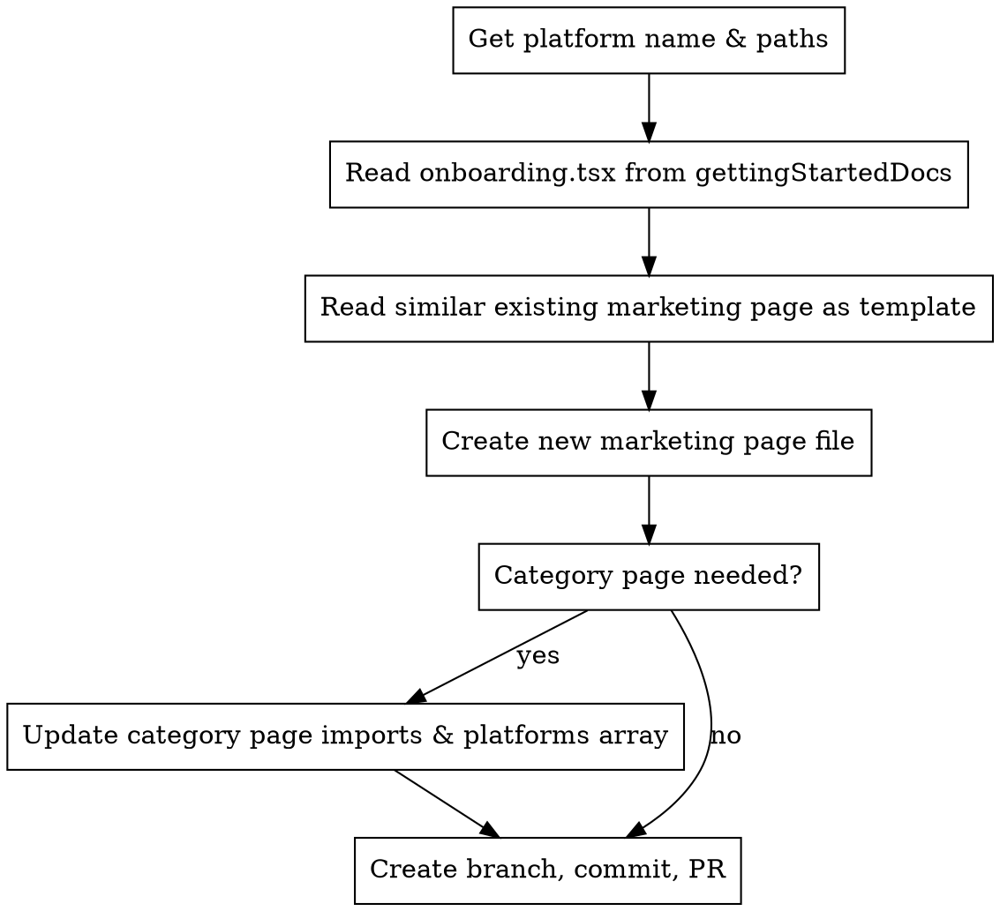

# Add Platform Marketing Page

## Overview

Add a single platform from Sentry's `gettingStartedDocs` to the static-sites marketing pages. This creates a standalone `/for/<platform>/` page and optionally adds it to a category page (like serverless.js).

## Required Information

Before starting, you need:

| Item | Example | How to get |
|------|---------|------------|
| Platform name | `node-cloudflare-workers` | From gettingStartedDocs directory name |
| Sentry repo path | `/path/to/sentry` | Ask user if not provided |
| Static-sites repo path | `/path/to/static-sites` | Usually current working directory |
| Category page (optional) | `serverless.js` | Ask user which category it belongs to |

**If paths not provided, ASK:**
```
I need two paths to proceed:
1. Path to the Sentry repo (contains static/app/gettingStartedDocs/)
2. Path to static-sites repo (contains packages/www/src/pages/for/)

Which platform are you adding?
```

## Process



## Step 1: Read the Onboarding Docs

Location: `<sentry-repo>/static/app/gettingStartedDocs/<platform>/onboarding.tsx`

Extract from the file:
- **Install command** - usually `npm install --save @sentry/<package>`
- **Configuration snippet** - the main setup code
- **Docs URL** - found in `nextSteps` links

## Step 2: Find a Similar Template

Look in `<static-sites>/packages/www/src/pages/for/` for a similar platform:

| Platform type | Use as template |
|---------------|-----------------|
| Serverless/Edge | `node-aws-lambda.js` |
| Node framework | `express.js` or `fastify.js` |
| Python framework | `django.js` or `flask.js` |
| Frontend framework | `vue.js` or `angular.js` |

## Step 3: Create the Marketing Page

Create `<static-sites>/packages/www/src/pages/for/<platform>.js`

**Required exports:**
```javascript
// 1. frontmatter - metadata for the page
export const frontmatter = {
  slug: 'sentry.javascript.<platform>',      // SDK identifier
  name: 'Platform Display Name',              // Human readable
  platformFamilies: ['sentry.javascript.node'], // Parent SDK
  logoPlatformIcons: ['platform-icon', 'node'], // Icons to show
  docsURL: 'https://docs.sentry.io/platforms/.../', // Full docs link
  tags: ['platform'],
  canonical: 'https://sentry.io/for/<platform>/'
};

// 2. GettingStartedComponent - the code snippets
export const GettingStartedComponent = () => { ... };

// 3. Default export - the full page component
export default PlatformPage;
```

**Code snippets:** Simplify the onboarding.tsx snippets - remove conditional params logic since marketing pages are static.

## Step 4: Update Category Page (if applicable)

If the platform belongs to a category (serverless, frontend, backend, etc.):

1. **Add import:**
```javascript
import * as PlatformName from './platform-name';
```

2. **Add to platforms array:**
```javascript
const platforms = [
  // ... existing platforms
  PlatformName,
];
```

## Step 5: Commit and PR

```bash
# Create feature branch
git checkout -b add-<platform>-marketing-page

# Stage and commit
git add packages/www/src/pages/for/<platform>.js
git add packages/www/src/pages/for/<category>.js  # if updated
git commit -m "Add <Platform> marketing page"

# Push and create PR
git push -u origin add-<platform>-marketing-page
gh pr create --title "Add <Platform> marketing page" --body "..."
```

## Common Mistakes

| Mistake | Fix |
|---------|-----|
| Wrong slug format | Use dot notation: `sentry.javascript.node-cloudflare-workers` |
| Missing GettingStartedComponent export | Required for category pages to import |
| Hardcoded DSN in snippets | Use placeholder: `https://<key>@sentry.io/<project>` |
| Forgot to update category page | Check if platform fits serverless, frontend, etc. |

## Platform Icon Names

Icons are referenced by name in `logoPlatformIcons`. Common mappings:
- `cloudflare` for Cloudflare
- `node` for Node.js
- `python` for Python
- `node-awslambda` for AWS Lambda (Node)

Check existing pages for correct icon names if unsure.
